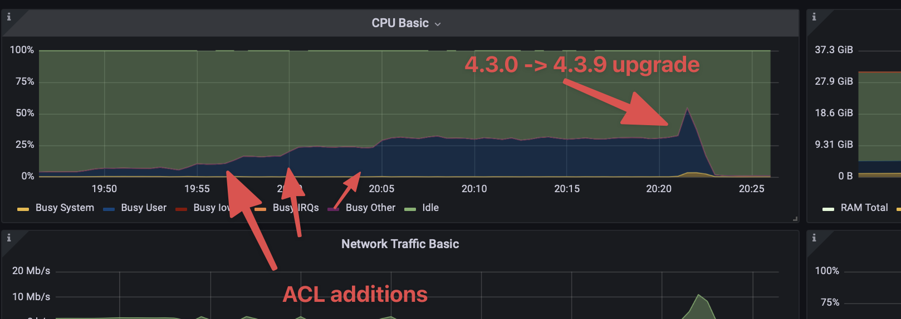

# EMQX ACL migration benchmark

## Starting point

Virtual environment created with [EMQX CDK](https://github.com/qzhuyan/cdk-emqx-cluster).

* 5-node EMQX cluster
* 2 loadgen VMs

## Test plan

* Provision EMQX < 4.3.8 cluster without ACL fix (we take 4.3.0).
* Connect many (100_000) pub and sub clients.
* Add many (100_000) ACL rules.
* Observe CPU consumption.
* Run upgrade to 4.3.9 version, with ACL fix.
* Observe CPU consumption during migration and after it.

## Provisioning

For initial provisioning we have [emqx.tar.gz](http://motospace.s3.amazonaws.com/emqx-4.3.0-to-4.3.9-f00e254b.tar.gz) wich contains:

* 4.3.0 release (`_build/emqx/rel/emqx` folder)
* Additionally 4.3.9-f00e254b zipped version (`emqx-ubuntu20.04-4.3.9-f00e254b-amd64.zip`) in its `releases` folder.
It is built with 4.3.0 as an upgrade base.

For provisioning we run:

```bash
ansible-playbook -i hosts setup.yml
```

This script:
* Shutdowns running 5.x version.
* Uploads and unpacks 4.3.0 `emqx.tar.gz`.
* Makes some config updates to enable mnesia auth and set correct node names.

## Starting 4.3.0

We start with:

```bash
ansible-playbook -i hosts start.yml
```
This starts 5 nodes and joins them into cluster.

## Connecting clients

On one of the nodes we run

```bash
./bin/emqx_ctl user add user pass
```

Then we run 50_000 pub-ers on one loadgen node and 50_000 sub-ers on the other:

```bash
ulimit -n 200000
/root/emqtt-bench/emqtt_bench pub \
    -h lb.int.emqx \
    -u user \
    -P pass \
    -t /%i/t \
    --ifaddr $(python3 -c 'print(",".join(f"192.168.0.{n}" for n in range(2, 251)))') \
    -c 50000
```

```bash
ulimit -n 200000
/root/emqtt-bench/emqtt_bench sub \
    -h lb.int.emqx \
    -u user \
    -P pass \
    -t /%i/t \
    --ifaddr $(python3 -c 'print(",".join(f"192.168.1.{n}" for n in range(2, 251)))') \
    -c 50000
```

## Adding ACL rules

Run

```bash
ansible-playbook -i hosts --extra-vars="start_from=0" create_acls.yml
# ... wait a bit
ansible-playbook -i hosts --extra-vars="start_from=5000" create_acls.yml
# ... wait a bit
ansible-playbook -i hosts --extra-vars="start_from=10000" create_acls.yml
...
```
till we have 100_000 ACL records.

At this point we can see (see image below) increasing constant CPU consumption as new ACL are added
although the rules are not related to the clients.

## Run upgrade

Upgrade
```bash
ansible-playbook -i hosts --extra-vars="upgrade_to_version=4.3.9-f00e254b" upgrade.yml
```

At this point we see CPU usage peak and then CPU usage reduction indicating that
ACL records do not consume CPU anymore.

## Illustration



## Conclusion

ACL migration causes a CPU peak for a short period of time and eliminates further constant CPU consumption
by each publish request.

